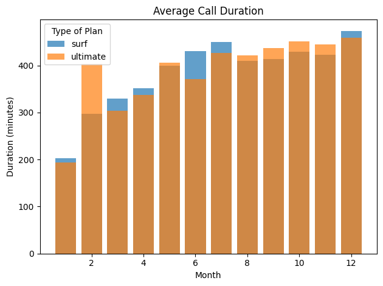
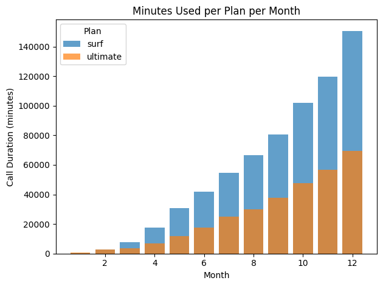
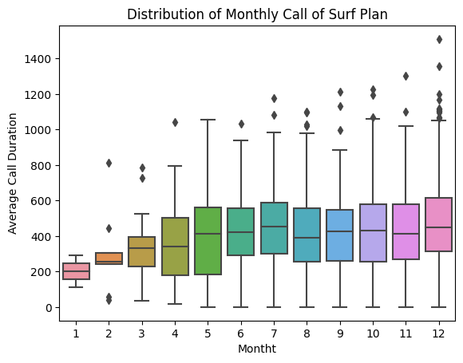
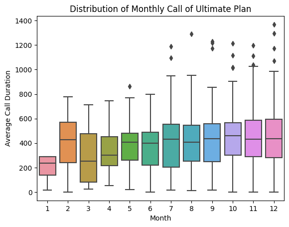
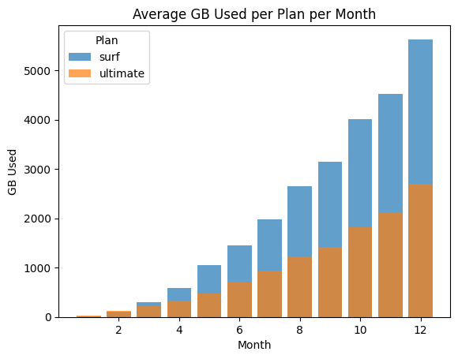
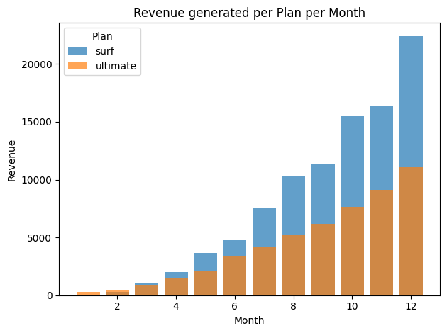

# Megaline_Business_Review
 Telecom giant Megaline has hired an analyst. The company offers its clients two prepaid plans, Surf and Ultimate. The commercial department wants to know which of the plans brings in more revenue in order to adjust the advertising budget for 2019
# 📡 Megaline Plan Revenue Analysis

When Megaline, a major telecom provider, wanted to understand which of their two prepaid plans—Surf or Ultimate—generated more revenue, they turned to data. As a newly hired analyst, you’re tasked with delivering insights that will guide the company's advertising strategy.

At first glance, the challenge seems straightforward: analyze 500 clients and determine which plan is more profitable. But as with most real-world data problems, the insights are buried under layers of transformation, aggregation, and statistical inference.

This project walks through the entire lifecycle of a data analysis task, from raw user activity logs to a final recommendation backed by statistical testing and visual insights.

---

## 🧠 Industry-Ready Skills Demonstrated

| Skill Category | Techniques / Tools Used |
|----------------|--------------------------|
| Data Cleaning | Handled missing values, checked duplicates, corrected datatypes |
| Feature Engineering | Aggregated monthly usage, calculated overages and revenue per user |
| Statistical Analysis | Performed hypothesis testing using t-tests |
| Data Visualization | Plotted distributions, trends, and usage comparisons |
| Communication | Structured storytelling and insights for business stakeholders |

---

## 📁 Data Overview

The analysis uses five main datasets:
- `users.csv`: client demographics and plan type
- `calls.csv`: individual call logs
- `messages.csv`: text message usage
- `internet.csv`: internet usage per session
- `plans.csv`: plan specifications and pricing

---

By combining all sources and performing in-depth statistical data analysis, this project identifies not only which plan brings in more revenue—but why. It's a hands-on example of turning messy telecom data into actionable business strategy.

---

🛠 Installation
Clone this repository or download the .ipynb file

Set up your Python environment:

bash
Copy
Edit
pip install pandas numpy matplotlib seaborn jupyter
Launch the notebook:

bash
Copy
Edit
jupyter notebook
🚀 Usage
Open Megaline Business Review.ipynb in Jupyter and run each cell in order. The notebook walks through:

Data loading and cleaning

Descriptive statistics and visualizations

Revenue and usage comparisons by plan

Hypothesis testing (e.g., differences in plan behavior or revenue)

📁 Project Structure
bash
Copy
Edit
Megaline Business Review.ipynb         # Main notebook with analysis
README.md                              # Project documentation
⚙️ Technologies Used
Python

Jupyter Notebook

Pandas

NumPy

Seaborn
Matplotlib
Scipy / Statsmodels

## 🔍 Summary of Results

| Key Insight | Outcome |
|-------------|---------|
| Plan generating more revenue | **Surf** |
| Usage trend | Surf users consistently exceed their limits (minutes, texts, GB) |
| Seasonal behavior | GB usage peaks in December, especially for Surf users |
| Hypothesis test (plan revenue difference) | p = 0.12 → Not statistically significant |
| Hypothesis test (NY/NJ revenue difference) | p = 0.03 → Statistically significant difference |

What I found was surprising. While the Ultimate plan offers generous allowances, most users stayed within their limits—meaning predictable revenue but few overage fees. The Surf plan, on the other hand, attracted heavy users who routinely exceeded their limits in minutes, messages, and gigabytes, especially as the year progressed. Despite being the cheaper plan, Surf quietly drove higher per-user revenue due to these consistent overages.

But the analysis didn’t stop there. Using hypothesis testing, I evaluated whether the revenue differences between plans were statistically significant—and whether geography played a role. The results: revenue differences between plans weren’t statistically significant overall (p = 0.12), but users from New York and New Jersey showed significantly different spending patterns (p = 0.03), suggesting targeted marketing opportunities.

Throughout the project, I:

Cleaned and structured messy, multi-source data

Engineered features like monthly overages and revenue per user

Built visualizations to track seasonal usage patterns

Performed statistical tests to validate business insights

This wasn’t just an exercise in code—it was an exercise in translating data into strategy.

--- 
## 📊 Visualizations

### Figure 1: Average Monthly Call Duration per Plan  

### Figure 2: Total Minutes Used per Month by Plan  

### Figure 3: Distribution of Monthly Call Counts by Plan  

### Figure 4: Monthly Internet Data Usage in GB  

### Figure 5: Revenue Per User by Plan Over Time  

### Figure 6: Revenue Comparison – NY/NJ vs Other Regions  

🤝 Contributing
Feel free to fork the project, explore alternative business questions, and submit a pull request with your improvements.

🪪 License
This project is licensed under the MIT License.

Scipy / Statsmodels

